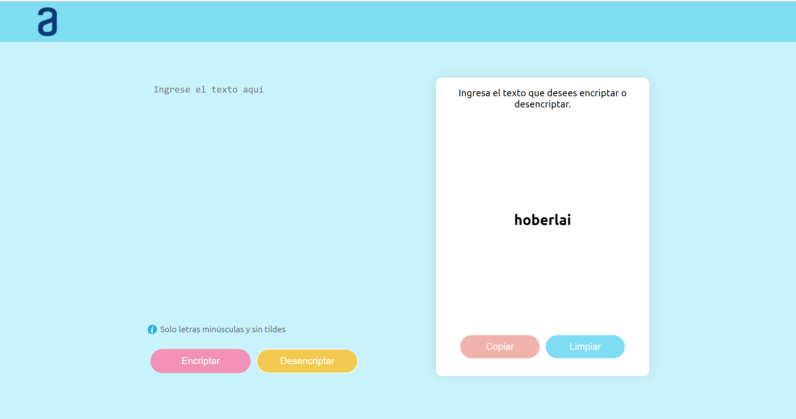

# challenge-encriptador-texto
# Encriptador de Texto

Este proyecto es una herramienta web que permite encriptar y desencriptar texto utilizando un método específico de sustitución. La aplicación está diseñada para trabajar con texto en minúsculas y sin tildes.
# Link github pages: https://lesliee97.github.io/challenge-encriptador-texto/
## Funcionalidades

### 1. **Encriptar Texto**
   - Permite convertir texto plano en un formato encriptado basado en un diccionario de sustituciones.
   - Las sustituciones se basan en el siguiente diccionario:
     - `e` → `enter`
     - `i` → `imes`
     - `a` → `ai`
     - `o` → `ober`
     - `u` → `ufat`

### 2. **Desencriptar Texto**
   - Permite convertir texto encriptado de vuelta a su formato original utilizando el diccionario de sustituciones inverso:
     - `enter` → `e`
     - `imes` → `i`
     - `ai` → `a`
     - `ober` → `o`
     - `ufat` → `u`

### 3. **Normalización del Texto**
   - El texto ingresado se normaliza eliminando tildes y caracteres especiales, dejando solo letras minúsculas y espacios.

### 4. **Interfaz de Usuario**
   - Campo para ingresar texto que será encriptado o desencriptado.
   - Botones para realizar las acciones de encriptar y desencriptar.
   - Visualización del texto resultante.
   - Opciones para copiar el resultado al portapapeles y limpiar la interfaz.

## Instrucciones de Uso

1. **Ingreso de Texto**
   - Introduce el texto en el área de texto proporcionada.

2. **Encriptar Texto**
   - Haz clic en el botón "Encriptar" para convertir el texto en su versión encriptada.

3. **Desencriptar Texto**
   - Una vez encriptado el texto, el botón "Desencriptar" estará habilitado. Haz clic en él para revertir el texto al formato original.

4. **Copiar al Portapapeles**
   - Después de obtener el texto encriptado o desencriptado, usa el botón "Copiar" para copiar el resultado al portapapeles.

5. **Limpiar**
   - Usa el botón "Limpiar" para restablecer el área de entrada y salida a su estado inicial.

## Capturas de Pantalla

1. **Interfaz Principal**
   - Captura de la página principal mostrando el área de entrada, botones y el área de salida.
   - 

2. **Texto Encriptado**
   - Captura mostrando el resultado después de hacer clic en el botón "Encriptar".
   - 

3. **Texto Desencriptado**
   - Captura mostrando el resultado después de hacer clic en el botón "Desencriptar".
   - 

4. **Texto Copiado al Portapapeles**
   - Captura del mensaje de confirmación después de copiar el texto al portapapeles.
   - 

## Tecnologías Utilizadas

- **HTML**: Estructura de la página web.
- **CSS**: Estilos y diseño de la interfaz.
- **JavaScript**: Lógica de encriptado/desencriptado y manipulación de la interfaz de usuario.

